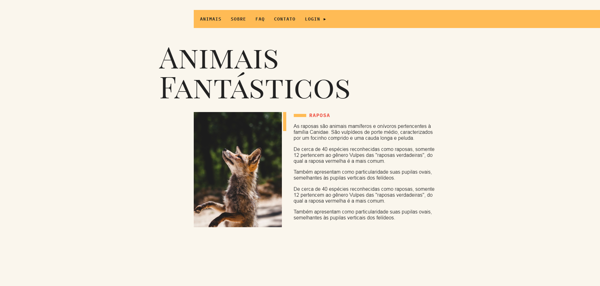

  

# 🦊 Animais Fantasticos Website
Projeto em que pratiquei todos os principais conceitos e a base do JavaScript como: Manipulação do DOM, Objetos, Classes, Regular Expressions, Funções Async e etc. Além das funções e soluções básicas da linguagem, treinei como fazer: Scroll Suave, Accordion, TabNav, Modal, Tooltip, Números Animados, Fetch, API's, Slides e etc.

- Veja o projeto: [Live Preview](https://victtor-777.github.io/Animais-Fantasticos/)

## ⚙️ Funcionalidades

- [x] Site totalmente responsivo e com animações;
- [x] Possui "Scroll Suave", ao clicar no menu é direcionado a sessão suavemente;
- [x] O site possui modal, tooltip, accordions e números animados;
- [x] Possui um slide fluido, que funciona com o mouse ou touch;
- [x] Possui uma requisição a API, para verificar se o local está aberto ou fechado, e para pegar o valor de bitcoin atualizado(para doações);

## 🚀 Tecnologias

- [HTML](https://www.w3schools.com/html/)
- [CSS](https://developer.mozilla.org/pt-BR/docs/Web/CSS)
- [JavaScript](https://developer.mozilla.org/pt-BR/docs/Web/JavaScript)

## 📝 Considerações

Nesse projeto do curso da Origamid, eu pude aprender bastante sobre JavaScript em geral, esse é um dos cursos mais completos de JavaScript do Brasil, apesar do projeto final não ser simples eu pude dominar os fundamentos da linguagem;
